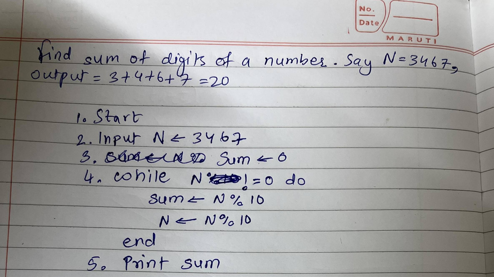

## Basics of Problem Solving
#### Pseudocode Assignment

1) Write pseudocode to print the following pattern 1 232 34543 4567654 567898765

2) Find sum of digits of a number. Say N = 3467, Output = 3 + 4 + 6 + 7 = 20

3) Pseducode to print all prime numbers in the range 1 to N.

4) Write a program to swap two numbers without using third variable.

