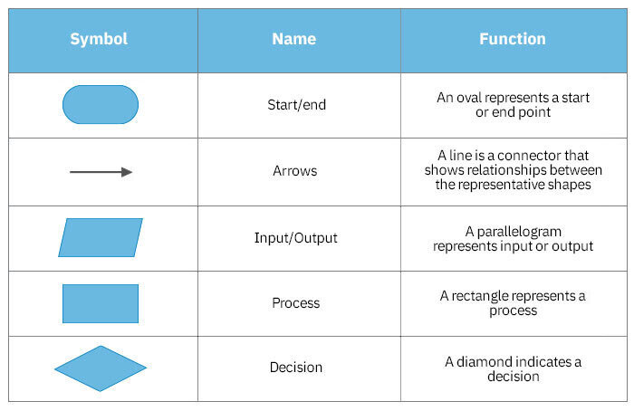

## Flowcharts are used to represent the logic flow(algorithm) in a very simple, graphic and layman manner
#### Different Shapes used for flowcharts:
- Start/End box
- Parallelogram
- Rectange
- Rhombus
- Circle

